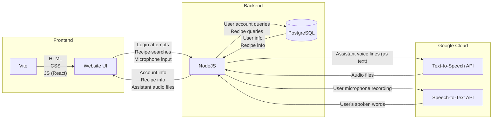
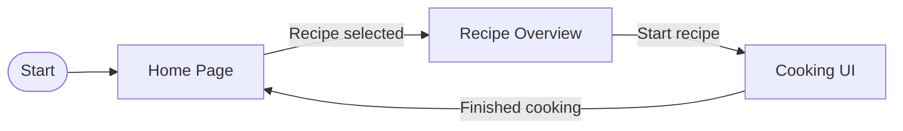
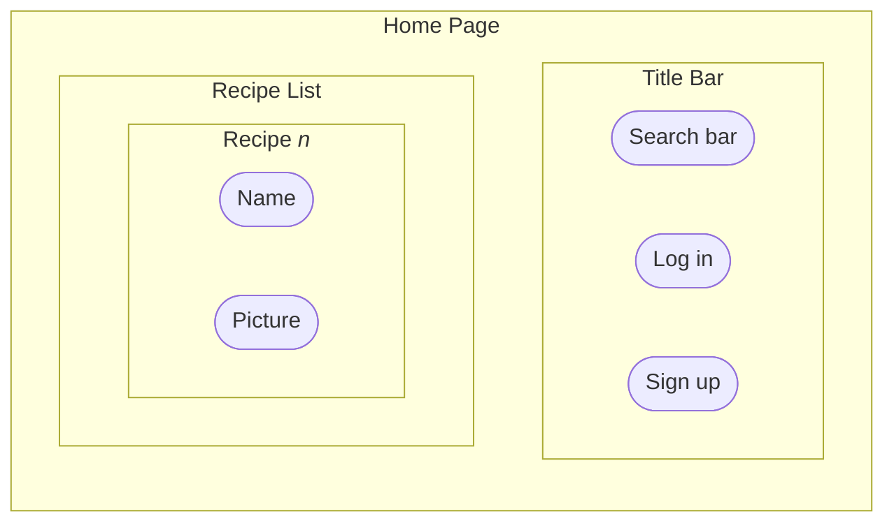
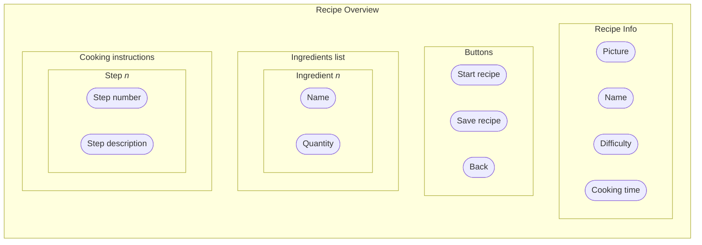
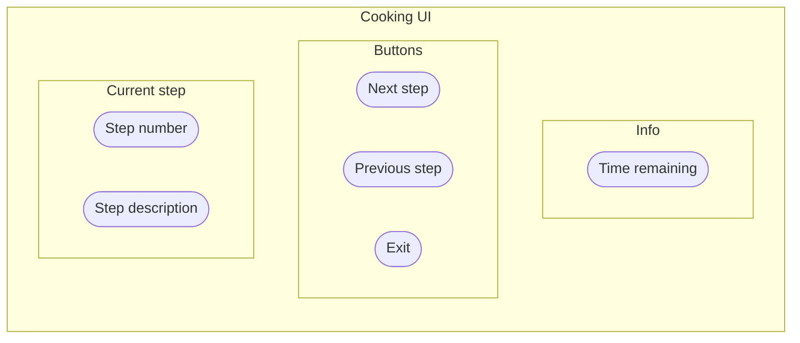

# Documentation
The diagrams for our project. Simple flowcharts should be made using [mermaid](https://mermaid.js.org/intro/) so they can be embedded in markdown and don't need an extra program to view or edit. More complicated diagrams like UI mockups can probably be made in [draw.io](https://draw.io).

## Project structure

The frontend is written in HTML, CSS, and JavaScript (using [React](https://react.dev)). The site is served using [Vite](https://vite.dev). The website makes HTTPS requests to the backend for things like login attempts and searching for recipes. Microphone input and assistant audio should probably be sent using WebRTC, which will need a WebSocket connection to open.

The backend is written in NodeJS. It communicates with the Google Voice API to transcribe microphone input from the user and also generate assistant voice responses. The backend also communicates with the SQL server to authenticate users and retrieve recipe information.

## UI Flow

Typical flow for selecting a recipe and cooking it (assuming the user is logged in).

## UI Content

Idea: Maybe the cooking UI should still show all steps, but the current step is highlighted and centered.